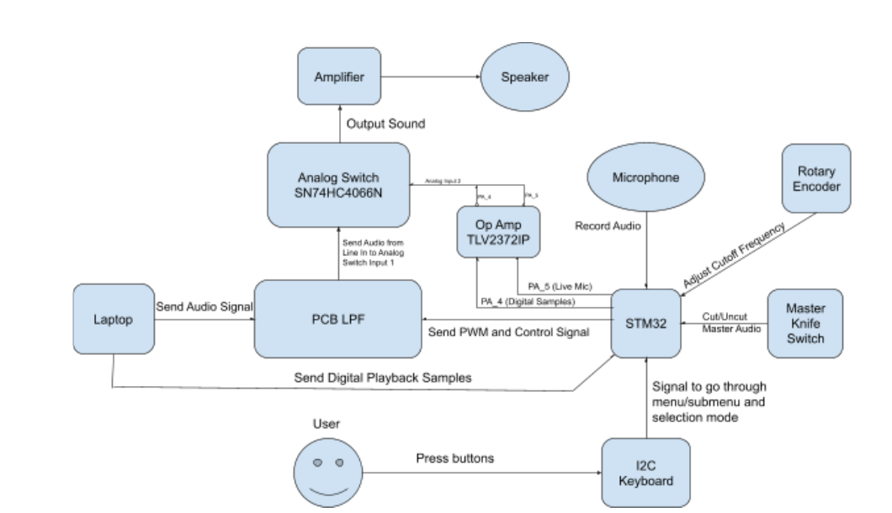
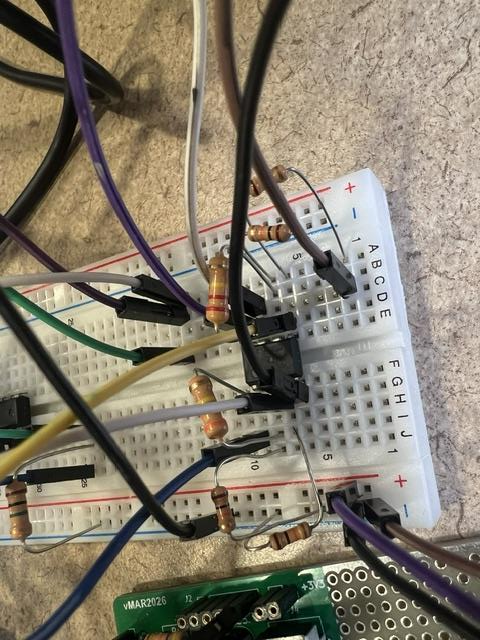
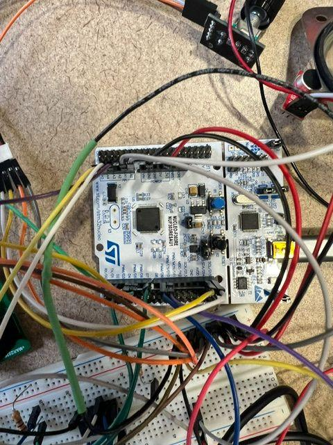
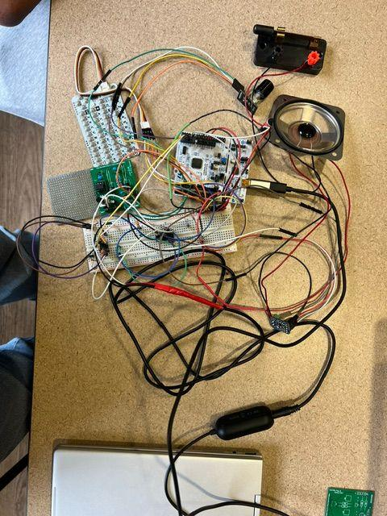

# DIY DJ Deck

An STM32-based audio mixer built from scratch: live microphone input,
preloaded sound-effect samples, a hardware low-pass filter with a
continuously variable cutoff, and a menu-driven keypad interface — all
running on bare-metal interrupt service routines, no RTOS.

**Course:** ECE 304 — Junior Design Project, Spring 2026
**Team:** Liam Earle (CompE), Phu Nguyen (CompE)

[Demo video]https://youtu.be/ebdKP2G_ZzI

---

## What it does

The deck has three selectable modes, navigated through an I2C keypad menu:

1. **Live Mic** — real-time microphone input routed through the DAC to the amplifier.
2. **Record / Playback** — records a few seconds of audio to memory and plays it back.
3. **Audio Samples** *(custom feature)* — plays one of three preloaded sound effects (cricket, air horn, "bruh") over the main music line-in, then automatically resumes the music.

All three share a continuously tunable analog low-pass filter, controlled
in real time by a rotary encoder, and a master knife switch that
hard-mutes every audio path at once.

## System diagram

**Inputs:** knife switch, rotary encoder, electret microphone, I2C keypad
**Outputs:** 3.5mm line-in passthrough, live mic / sample playback via DAC, PWM control signals to the filter and analog switch

## Signal path

| Signal | Path |
|---|---|
| 1 | Electret Mic → STM32 (PA0, ADC) → STM32 (PA5, DAC) → Op-Amp → Analog Switch → Amplifier |
| 1 (samples) | STM32 (PA4, digital samples) → Op-Amp → Analog Switch (same node as mic) → Amplifier |
| 2 | 3.5mm Line In → PCB Low-Pass Filter → Analog Switch → Amplifier |
| 3 | STM32 (D7, D2) → Optocouplers (Rvar1, Rvar2) — sets LPF cutoff frequency |
| 4 | STM32 (D9, D10) → Analog switch control pins — selects active audio source |

The op-amp buffers the mic and sample paths into the shared analog switch
input, while the switch itself (SN74HC4066N) selects which source — line
in, or mic/sample — reaches the amplifier at any given time.

## Low-pass filter

- **Topology:** Sallen–Key
- **Tunable range:** 100 Hz – 12 kHz, swept via two optocoupler-controlled variable resistors (Rvar1, Rvar2)

| Component | Value |
|---|---|
| C1, C4 | 47 µF |
| C2, C3 | 4.7 nF |
| C6 | 100 µF |
| C7 | 100 nF |
| R1, R2 | 470 kΩ |
| R3, R4 | 47 kΩ |

Rvar1 and Rvar2 must track each other — if they diverge, the filter
response becomes asymmetric and the cutoff frequency calculation no
longer holds. The STM32 sweeps both together via a shared lookup table
(`filterLookup` in `main.cpp`) keyed by rotary encoder position, each
entry mapping to a matched PWM duty cycle pair for both optocouplers.

**Result:** as cutoff frequency increases, the audio clears up and gets
noticeably louder — the filter performed reliably and predictably across
its full tuning range.

## Custom feature: Audio Samples

Three preloaded sound effects (cricket, air horn, "bruh") are stored as
PCM sample arrays in flash (`cricket.h`, `air_horn.h`, `bruh.h`) and
played back through the DAC on keypad press, automatically resuming the
background music afterward via the analog switch. A fourth mode was
added beyond the original proposal — an analog switch (SN74HC4066N) to
toggle between line-in and sample sources — once it became clear during
the build that routing both into the amplifier directly wasn't viable.
(Substituted for the originally planned SN74VL4051AN, which was out of
stock in the parts room.)

**Status:** working, with two known limitations — digital sample
playback is quieter than the music line and requires manually trimming
the LPF cutoff to hear clearly, and a 44.1 kHz target sample rate for
Record/Playback mode wasn't reached (samples currently play back at a
lower effective rate).

## Debugging highlights

**Problem 1 — no sound from the 3.5mm line-in.**
Voltage measurements confirmed signal was present all the way to the
speaker, which pointed at the amplifier itself. Adjusting the onboard
potentiometer revealed its retaining tab had physically broken, leaving
it without a stable detent — a small nudge could cut the signal
entirely. Found a specific stable position via trial and error as a
workaround.

**Problem 2 — stored sample arrays played silence.**
Converting sound effects from raw audio to a hex array using an online
converter produced arrays that looked populated but played nothing.
Switching to a Python-based raw-to-hex conversion (and manually trimming
silence from the array) fixed the encoding issue — but playback was
still silent afterward. Tracing the wiring found a miswired ground that
should have shared a node with the line-in/output path; correcting it
resolved the issue completely.

## What went well / what we'd improve

**Went well:** the LPF PCB worked correctly on first integration — a
point of failure for several other teams in the course — along with the
sample playback feature, the line-in/sample source switch, and team
work partitioning.

**Would improve:** live mic noise and clarity, sample output volume
relative to the music line, amplifier output pin placement on the PCB,
and overall wiring cleanliness. We'd also swap the 4-channel analog
switch for the 8 in/out MUX suggested in the original project spec, and
replace the amplifier damaged during debugging.

## Build photos

| LPF breadboard prototype | STM32 wiring | Full integrated build |
|---|---|---|
|  |  |  |

## Hardware

- STM32 Nucleo-F303RE
- TLV2372IP dual op-amp
- SN74HC4066N quad analog switch
- Rotary encoder, master knife switch, CardKB I2C keypad
- Electret microphone, 8 Ω speaker, Adafruit amplifier
- Discrete LPF components — see [Low-pass filter](#low-pass-filter) above for full values and Digikey part numbers in the original report

## Limitations

- Record/Playback mode targets 44.1 kHz but doesn't currently reach it — audio in that mode plays back at a reduced effective sample rate.
- Digital sample playback volume is lower than the music line and currently needs a manual cutoff-frequency adjustment to hear clearly.
- A second DAC channel was planned for a separate live-mic amplifier path to reduce noise, but couldn't be driven to a usable volume and is disabled in the current firmware (see the commented-out block in `MX_DAC1_Init()`).
